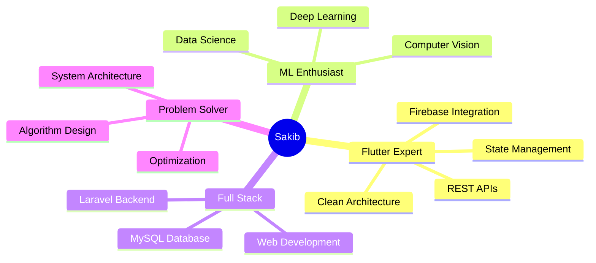

<!-- <h1 align="center">Hi 👋, I'm Sakib Bin Faruque Rusho</h1>
<h3 align="center">A passionate Flutter developer from Bangladesh 🇧🇩</h3>

<p align="center">
  
</p>

<p align="center">
  
</p>


---

### 👨‍💻 About Me

- 🔭 I’m currently working on **scalable, production-ready mobile apps using Flutter and Firebase**
- 🌱 I’m expanding my expertise in **Clean Architecture**, **BLoC/Cubit**, and **GetX/MVVM** patterns
- 💡 I love working on **real-world projects** that solve problems and deliver impact
- 📚 I also have a strong foundation in **Machine Learning**, **Computer Vision**, and **Backend (Laravel, MySQL)**
- 🎓 Final year student at the **University of Rajshahi**, Department of CSE
- 📝 My thesis: **"Enhancing Remote Sensing Object Detection using RetinaNet"**
- ✉️ Reach me at: **sbfrusho.arafat09@gmail.com**

---

### 🚀 Tech Stack

#### 💙 Flutter Development
- Dart, Flutter, Firebase, REST APIs, Dio, Retrofit
- State Management: BLoC, Cubit, GetX, Provider
- Design: Figma, Responsive UI, Animation
- Tools: Android Studio, VSCode, Git, Postman, Colab

#### 🧠 AI/ML & Data
- Python, TensorFlow, PyTorch, Scikit-learn, OpenCV
- Data Visualization: Pandas, Seaborn, Matplotlib

#### 🌐 Web & Backend
- HTML, CSS, PHP, Laravel, MySQL, Postman

#### 🛠 Others
- Linux, Git, GitHub, Firebase Auth, Firestore, Realtime DB, Cloud Storage

---

### 📊 GitHub Stats

<p float="left">
  
  
</p>

<p align="center">
  
</p>

---

### 🌍 Connect with Me

<p>
  <a href="mailto:rushocseru28@gmail.com">
    
  </a>
  <a href="https://linkedin.com/in/sakib-rusho" target="_blank">
    
  </a>
  <a href="www.linkedin.com/in/sbfrusho-arafat09" target="_blank">
    
  </a>
</p> -->


<div align="center">

# 👋 Hey there! I'm Sakib Bin Faruque Rusho

### 🚀 Flutter Developer | 🤖 ML Enthusiast | 🎓 CSE graduate


[](https://github.com/sbfrusho)

</div>

---

## 🌟 About Me

```dart
class Developer {
  final String name = "Sakib Bin Faruque Rusho";
  final String location = "Bangladesh 🇧🇩";
  final String university = "University of Rajshahi";
  final String department = "Computer Science & Engineering";
  
  List<String> currentFocus = [
    "📱 Scalable Flutter Apps",
    "🏗️ Clean Architecture & Design Patterns",
    "🔥 Firebase & Cloud Integration",
    "🧠 ML/CV Research & Development"
  ];
  
  String thesis = "Enhancing Remote Sensing Object Detection using RetinaNet";
  
  void sayHi() {
    print("Let's build something amazing together! 🚀");
  }
}
```

<div align="center">

### 💼 What I'm Up To

| 🔭 Currently Working On | 🌱 Currently Learning | 💡 Passionate About |
|:---:|:---:|:---:|
| Production-ready Flutter apps | Advanced State Management | Real-world problem solving |
| Firebase integrations | Clean Architecture patterns | Open source contribution |
| ML/CV research projects | GetX & MVVM | Innovation & Impact |

</div>

---

## 🛠️ Tech Arsenal

<div align="center">

### 💙 Mobile Development


**State Management:** BLoC • Cubit • GetX • Provider • Riverpod

**APIs & Networking:** REST APIs • Dio • Retrofit • GraphQL

### 🧠 AI/ML & Data Science


**Data Tools:** Pandas • NumPy • Matplotlib • Seaborn

### 🌐 Backend & Web


### 🔧 Tools & Platforms


</div>

---

## 📊 GitHub Statistics

<div align="center">
  
  
</div>

<div align="center">
  
</div>

<div align="center">
  
</div>

---

## 🏆 GitHub Achievements

<div align="center">
  
</div>

---

## 🎯 Featured Projects

<div align="center">

<table>
<tr>
<td width="50%">

### 📱 Flutter Apps
- 🔥 **E-commerce Platform** - Full-stack shopping app
- 💬 **Chat Application** - Real-time messaging with Firebase
- 🏥 **Healthcare Management** - Patient tracking system
- 📊 **Expense Tracker** - Personal finance manager

</td>
<td width="50%">

### 🤖 ML/CV Projects
- 🛰️ **RetinaNet Object Detection** - Thesis project
- 🖼️ **Image Classification** - CNN-based classifier
- 👁️ **Face Recognition** - OpenCV implementation
- 📈 **Data Analysis** - Predictive modeling

</td>
</tr>
</table>

</div>

---

## 💡 Key Highlights

<div align="center">



</div>

---

## 🎓 Education & Research

<table align="center">
<tr>
<td align="center" width="50%">

### 🏛️ University of Rajshahi
**Bachelor of Science in CSE**
- Final Year Student
- Focus: Mobile Development & ML
- CGPA: Excellent Standing

</td>
<td align="center" width="50%">

### 📝 Thesis
**Enhancing Remote Sensing Object Detection using RetinaNet**
- Computer Vision
- Deep Learning
- Remote Sensing
- Object Detection

</td>
</tr>
</table>

---

## 📈 Weekly Coding Activity

<!--START_SECTION:waka-->
<!--END_SECTION:waka-->

---

## 🤝 Let's Connect!

<div align="center">

[](mailto:sbfrusho.arafat09@gmail.com)
[](https://linkedin.com/in/sakib-rusho)
[](https://github.com/sbfrusho)
[](https://sbfrusho.github.io)

### 💬 Open for Collaboration!

**Interested in:**
- 🚀 Flutter Development Projects
- 🤖 ML/AI Research
- 🌐 Open Source Contributions
- 💼 Freelance Opportunities

</div>

---

<div align="center">

### 💭 Developer Quote


### 🐍 Contribution Snake


---

### 📊 Profile Summary


---


**⭐️ From [sbfrusho](https://github.com/sbfrusho) with ❤️**

*"Code is like humor. When you have to explain it, it's bad."* – Cory House

</div>
